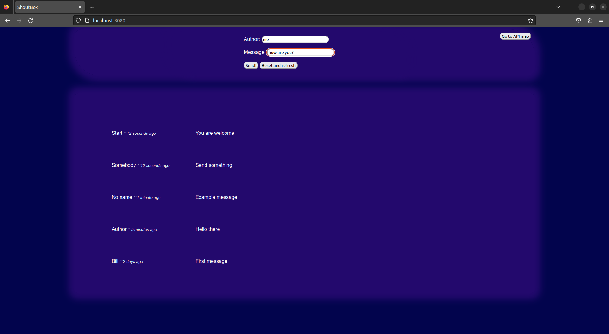
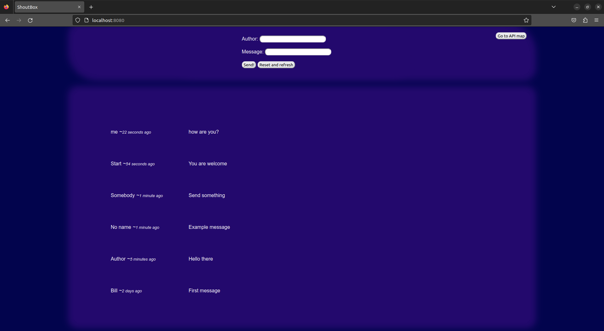

# ShoutBox

## What was the purpose of writing this program
Play a little bit with database. I also wanted to improve my HTML and CSS skills, which are currently not very impressive

## What it can do and what do you need
A simple app to send messages between several people. In the upper right corner, I added a button that redirects to the API map page. To run, open the console in the directory with the pom.xml file and enter "mvn clean install" and then "mvn spring-boot:run"

_Before sent a message_ \

_After_ \

